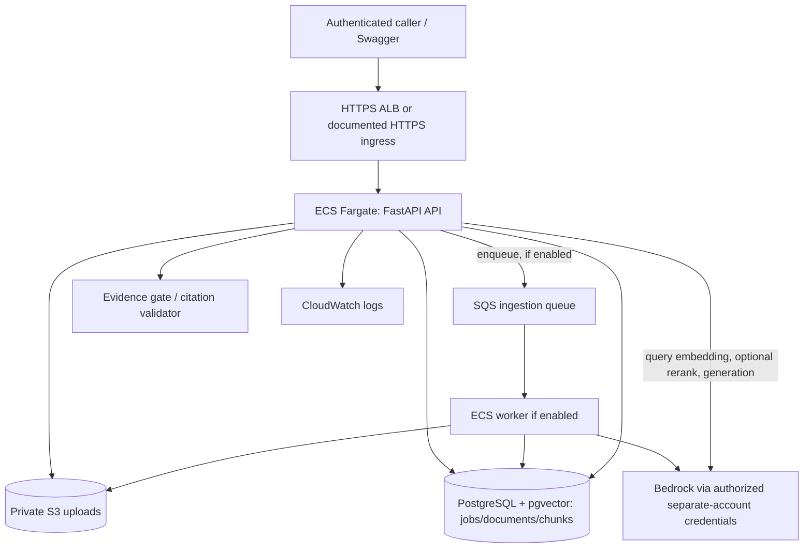

# Addroit Document Q&A — Incremental Execution Plan

> **Source of truth:** `project-information/Aditya_Assessment.pdf`, Addroit Inc., four pages, 5-day timeline. The PDF does not state an issue date or exact submission cutoff; the previously recorded 17 September issue date and 20 September internal target are unverified. Confirm the cutoff with Addroit; do not imply an extension or that the target has passed. This is an execution plan, **not evidence of completed work**. **Implementation choice agreed with Aditya:** ECS Fargate, FastAPI, S3, PostgreSQL + pgvector, Bedrock models using separately authorized account credentials (authorization and integration still to verify), optional reranker, layered grounding. AgentCore is out of scope. The PDF proposes options, not a mandated recipe: distinguish its requirements from our design decisions.

## 0. How to use this file

- Codex must read the assessment PDF, this file and `AGENTS.md` before editing. If the PDF isn't in the repo, request it or use the requirements matrix below; do not claim an unseen version is identical.
- Work **one numbered task at a time**. For each: implement one cohesive function or one endpoint slice; write tests; run validation; explain code, tradeoffs and assessment relevance to Aditya; update the progress ledger; **STOP for review** before the next task.
- Never silently provision billable resources, make real Bedrock calls, expose credentials, or push public code/data. Get approval for each billed integration/deployment action. Unit tests use fakes.
- Maintain `docs/decisions.md` (actual choices/why), `docs/progress.md` (task / tests / result / remaining issues), `docs/assessment-traceability.md` (PDF page/requirement ↔ implementation ↔ test/demo). Do not tick a task until its gate is verified.

## 1. Assessment requirements and traceability

| Assessment location | What reviewer expects | Implementation + check |
|---|---|---|
| p1 §1–2 | Live AWS-native upload → extract → chunk → embed → retrieve → Q&A | ECS FastAPI + private S3 + Bedrock + pgvector; deployed smoke test |
| p1 §2 | Verifiable source citations | Server-side chunk/document/page mapping; citation tests |
| p1 §2 and p2 | Refuse unsupported answers, prioritize grounding | Pre-LLM evidence gate + context-only prompt + post-generation citation/claim checks; negative tests |
| p2 requirements | 10–15 ground-truth Q&A evaluations | Versioned dataset, actual runs and honest metrics/failure analysis |
| p2 requirements | Cost awareness; sensible authenticated API + validation | Budget/estimated recurring costs, auth, file/query caps, HTTP contract tests |
| p3 §3 | Managed AWS, S3, IAM least privilege; ECS accepted; async ingestion a plus | ECS task role, private bucket, SQS + worker if feasible, secrets documented |
| p3 §4 | Live endpoint, GitHub + README, eval results, architecture diagram | Submission checklist and fresh-client demo |
| p4 §5 | Explain walkthrough, tradeoffs, limitations, scaling to 500K documents | Defense notes after every task; recorded dry-run |

**Scope control:** Core deliverables come before reranker, Bedrock Guardrails, SQS worker, fancy frontend or AgentCore. A reranker is an elective design choice, not a requirement. If optional features threaten the deadline, turn them off using explicit feature flags; show truthful limitations. Do not misrepresent a demo as production-ready.

## 2. Frozen interfaces and deployment decisions

### 2.1 Proposed runtime



The SQS worker is the **preferred durable async** shape, not automatically in MVP. If unavailable, a bounded demo-mode worker is allowed only with honest documentation of restart/loss semantics; an HTTP 202 alone is not durable async. Never expose partial chunks from unready documents. Do not add a NAT Gateway without explicitly estimating its fixed and traffic charges. ECS, ALB, RDS, public IP, logs, SQS, Secrets Manager and data transfer can cost money even at idle. Verify regional prices and choose a spending cap with the user; AWS Budget alarms are *not hard spending stops*.

### 2.2 Bedrock credentials blocker — gate BEFORE integration

1. Confirm without disclosing the secret: **Bedrock API key** (bearer token) versus **AWS access-key ID + secret** versus assumed-role credentials. Verify whether embeddings, generation and reranking are each accessible; access to one does not imply access to all.
2. The ECS **task role in our AWS account does not automatically authorize inference in the other account**. Prefer an explicitly authorized cross-account assume-role path if available; otherwise a compatible Bedrock API key kept in Secrets Manager and used with the supported request/auth path. Do not assume a bearer key works with boto3's ordinary SigV4 client. Implement an adapter selected by config and verify it against a minimal live call only after approval.
3. Ask whether the third-party account owner authorizes assessment usage and pays inference charges; document credential lifetime, model IDs, region, quotas and any Guardrails permissions. Never put credentials in repository, CLI output, API responses or logs.
4. Fail with a clear **service unavailable** error if provider credentials/models are not confirmed; do not quietly substitute a non-Bedrock provider or simulate live results. Keep local testability with deterministic fakes.

### 2.3 API contracts (versioned)

All routes under `/api/v1` except `/health`. Authentication via `X-API-Key` on application routes; never return the key. Accept PDF or UTF-8 TXT; enforce file size, file count, MIME/signature, and empty/image-only handling. API error body: `{ "error": { "code": "...", "message": "..." } }` (do not leak stack traces). Use Pydantic schemas.

| Method & route | Request | Success | Failure cases |
|---|---|---|---|
| `GET /health` | none | `200 {"status":"ok"}`; optionally separate readiness probes | 503 on dependency-readiness endpoint, never expose secrets |
| `POST /api/v1/ingest` | `multipart/form-data` one bounded `file` | `202 {ingestion_id, document_ids, status:"PENDING"}` | 401, 413, 415, 422, 503 |
| `GET /api/v1/ingest/{ingestion_id}/status` | scoped job ID | `200 {ingestion_id, document_ids, status, stage, progress, error}` | 401, 404 (including cross-owner), 503 |
| `POST /api/v1/chat` | `{question, document_ids?: string[], top_k?: int}` | `200 {status:"ANSWERED"\|"INSUFFICIENT_CONTEXT", answer, sources, retrieval?}` | 401, 422, 503 |

`retrieval` may include `initial_k`, `final_k` and a **separate** diagnostic candidate list for the demo; `sources` contains only verified, actually cited evidence. Scores are diagnostics; label similarity/rerank semantics and never present them as calibrated probabilities. Do not expose raw chunks to callers outside authorized scope. If using single demo API key, explicitly state that this is a single-principal access model; don't claim real multi-tenancy.

### 2.4 Data model

- `ingestion_jobs`: `id`, `owner_id`/demo principal, `status(PENDING|PROCESSING|COMPLETED|FAILED)`, `stage`, progress counts, sanitized error, timestamps, idempotency key.
- `documents`: `id`, owner, original filename, S3 key, checksum, mime, size, status(`PROCESSING|READY|FAILED`), timestamps, embedding model/version.
- `chunks`: stable `id`, `document_id`, ordinal, page (nullable for TXT), offsets if available, content, embedding `vector(d)` matching selected model output, token/char count, chunker version. FK + index, cosine distance operator, scoped retrieval. Use exact vector dimension established by live/model config; do not guess.
- A job and all its documents are marked completed/ready only after all expected chunk writes succeed. Reprocessing is idempotent; on failure, clean or quarantine incomplete rows. Avoid a schema that makes half-ingested content visible.

### 2.5 Core RAG decisions

- PDFs: extract page by page; TXT: decode UTF-8; reject scanned/no-extractable-text for MVP with clear limitation rather than pretending OCR works. Stable chunk IDs; deterministic character/token chunking with configurable chunk size/overlap, preserving source metadata.
- Ingest and query use **the same embedding model and vector dimension**. Query: cosine search restricted to READY and authorized documents; initial `k=10` as a configurable starting point; optional rerank to final `k=5`, configurable and evaluated. No claim that these numbers are optimal.
- Refusal is layered: no evidence → refuse before generation; insufficient evidence decision evaluated on labeled questions (not naive universal cosine threshold); prompt contains only numbered untrusted context; parse bounded structured output; verify every cited ID maps to retrieved evidence and verify answer support where feasible; fail closed on missing/invalid source/unsupported claims. A source ID's existence alone is not proof that it supports the claim. Explain remaining limitations.
- Optional Bedrock Guardrails: verify account/model/integration feasibility and cost first. Guardrails are *supplementary*, not a substitute for retrieval/evidence/citation checks. Implement behind config; don't block core MVP.

## 3. Step-by-step implementation: STOP at every gate

Every task has exactly the progression **inspect → implement → unit tests → lint/type/check → optional approved live test → explain → record → stop**. A task is not done when code merely looks correct. A `FAIL` or `BLOCKED` gate halts dependent work; fix or document an approved scope change.

### Phase A — baseline and verified prerequisites

- [x] **A0 — Inventory and source alignment.** Function: none. Inspect repo, PDF, existing files, Git status; create requirement traceability, progress ledger, and explicit baseline list. **Gate:** no invented implementation status; every mandatory PDF requirement represented. Explain required vs chosen features. See `docs/progress.md`; candidate approved Phase A on 2026-09-21.
- [x] **A1 — Configure project.** Create Python/FastAPI package, pinned dependencies, `.env.example`, `.gitignore`, `ruff`, `pytest`, Dockerfile and dev commands. **Gate:** fresh install/import, formatting, sample test, container build pass; secret-scanner or grep clean. Explain container entrypoint. **PASS 2026-09-22: local checks, Docker build and container smoke checks passed using Docker Desktop via `docker.exe`.** See `docs/progress.md`.
- [ ] **A2 — AWS/Bedrock access probe (approved only).** `scripts/check_access.py`: identify caller account/region safely; check S3/storage/DB planned permissions; tiny real generation and embedding probes for each credential path/model only after consent. Reranker separately. **Gate:** recorded actual success/error without printing keys or claiming access inferred from AWS console. If inaccessible, mark LIVE-BEDROCK blocked; mock tests still allowed. Explain authorization across accounts.
- [ ] **A3 — Database schema and migration.** Tables, indexes, constraints, vector dimensions; repository transaction helpers. **Gate:** migration up/down against disposable PostgreSQL with pgvector; FK, uniqueness, scope and READY restrictions tests. Explain cosine operator and dimensions.

### Phase B — small ingestion functions, then endpoints

- [ ] **B1 — Auth and request validation.** `verify_api_key`, file/question validators and consistent exception mapper. **Gate:** valid/invalid/missing key, empty question, oversize/invalid files; no secret log. Explain fail-closed behavior.
- [ ] **B2 — S3 repository.** `put_document`, `get_document`, optionally `delete_document`; private bucket and restricted prefix. **Gate:** fake/unit and approved S3 round trip; failure propagated, no public object. Explain S3 vs DB responsibilities.
- [ ] **B3 — Text extraction.** `extract_pdf_pages`, `extract_txt`; carry page/offset metadata. **Gate:** multi-page sample, blank page, invalid PDF, scanned PDF, UTF-8 errors; compare page mapping to source. Explain OCR limitation.
- [ ] **B4 — Chunker.** `chunk_pages` deterministic output; size/overlap configurable and bounded. **Gate:** boundary, no empty chunks, stable IDs, correct page association, no infinite loop. Explain overlap and double-chunk-size tradeoff.
- [ ] **B5 — Embedding provider.** `embed_texts` with Bedrock adapter, retries/backoff, dimension checks; same model for query. **Gate:** fake unit tests for shape/error/throttle; approved minimal live embed or `BLOCKED`. Explain model selection and cost.
- [ ] **B6 — Chunk persistence.** `upsert_chunks`, `mark_document_ready`, idempotent retry. **Gate:** rollback/retry does not duplicate or expose partial chunks; scoped SQL returns only READY. Explain transactional boundary.
- [ ] **B7 — Ingestion orchestrator.** `create_job`, `process_job` ties S3 → extraction → chunks → embeddings → DB; persists progress and sanitized failures. **Gate:** end-to-end fake test, duplicate request, mid-embed failure/retry; no READY on error. Explain status transition.
- [ ] **B8 — `POST /api/v1/ingest`.** Authenticated multipart and job creation, `202`. **Gate:** HTTP contract tests and queued/running status; demonstrate it doesn't block for full embedding on async mode. Explain HTTP 202 semantics.
- [ ] **B9 — `GET /api/v1/ingest/{id}/status`.** Scoped lookup and stable status/progress schema. **Gate:** PENDING/PROCESSING/COMPLETED/FAILED/unknown/other owner tests. Explain persistence across process restart.
- [ ] **B10 — Durable worker (conditional).** If approved and feasible: SQS queue, message contract, ECS worker, ack after success, retries/DLQ and visibility timeout. **Gate:** worker processes/retries idempotently; SQS poison message handled. If skipped, explicitly document in-process worker risks and do **not** call it durable.

### Phase C — small retrieval/grounding functions, then chat endpoint

- [ ] **C1 — Query embedding.** `embed_query`, dimension/model consistency. **Gate:** empty query, model mismatch and mock happy-path. Explain why query and document space must match.
- [ ] **C2 — Retrieval.** `retrieve_candidates`: pgvector cosine query with doc/owner/READY filters, k clamp, stored metadata. **Gate:** fixed vectors produce expected ordering; cross-owner/failed/unready excluded; verify distance-to-similarity transformation. Explain SQL/index vs exact scan for small corpus.
- [ ] **C3 — Optional reranker.** `rerank_candidates` adapter; verify Bedrock capability and schema. **Gate:** fake ordering/exception/fallback tests; approved live test only if access. Compare retrieval recall / cost / latency with and without; never invent score interpretation. If unavailable, default passthrough and document omission.
- [ ] **C4 — Pre-generation evidence gate.** `assess_evidence` using tested heuristic/coverage; empty/weak → `INSUFFICIENT_CONTEXT` **without LLM call**. **Gate:** labeled answerable and unanswerable examples including deceptively similar text. Explain false accept/refuse risk; thresholds determined from evaluation, not asserted as universal.
- [ ] **C5 — Generation prompt and parser.** `build_context`, `generate_answer`, `parse_llm_response`: numbered evidence IDs, context treated as data, structured JSON result/refusal, bounded tokens and retries. **Gate:** malformed output, prompt injection in document, unsupported question, model error; log only safe metadata. Explain prompt limitations.
- [ ] **C6 — Citation/evidence verification.** `validate_citations`, `assemble_sources`: only actual retrieved IDs; bind document/page/quote from database, not model; reject unsupported/missing citations. Optionally evidence entailment check if feasible. **Gate:** fabricated citation, wrong page, unsupported answer, duplicate source, valid multi-source case. Explain citation ID validation vs semantic support.
- [ ] **C7 — Chat orchestrator.** `answer_question` links C1–C6, output status, latency/token diagnostics when available. **Gate:** fake full-flow answered/refused, embedding/provider errors, no documents, scoped filtering. Explain which failures yield 4xx/503 vs evidence refusal.
- [ ] **C8 — `POST /api/v1/chat`.** Pydantic input/output, auth, error handling, `sources` vs optional diagnostic `retrieved_chunks` separation. **Gate:** OpenAPI + HTTP contract tests; top-k limits; exact input/out-of-scope/refusal demos. Explain endpoint line by line.

### Phase D — evaluation and deployment, then submission

- [ ] **D1 — Evaluation corpus.** `eval/questions.jsonl` with 10–15 question/expected answer/evidence IDs/answerability; include paraphrases, conflicting data and out-of-document questions. **Gate:** human-reviewed ground truth and referenced real documents, no fabricated expected citations.
- [ ] **D2 — Evaluation runner.** `scripts/evaluate.py` computes retrieval recall@k, citation validity, answer correctness (explicit rubric/manual or judge with disclosed limits), refusal precision/recall or counts, failure cases, latency and calls. **Gate:** deterministic metric unit tests; real run persisted to `eval/results.json` with date/model/config; never mark fake values as measured. Compare reranker on/off if used.
- [ ] **D3 — Security and operational review.** Scope IAM/S3, API key/Secrets Manager, input limits, CloudWatch safe logging, status auth, throttling/rate guard, health endpoints, ECS task vs execution roles. **Gate:** negative test checklist + secret scan and explicit residual risks.
- [ ] **D4 — Infrastructure and ECS deployment (explicit user approval required).** Container → ECR → ECS Fargate; S3; PostgreSQL pgvector (RDS if provisioned); ALB/HTTPS or other documented secured ingress; SQS if enabled; network/security groups. **Gate:** actual deployment logs, accessible endpoint, health check, S3 access, DB network access, embedding + generation real invocation. Log exact deployed topology and real estimated recurring cost; no invented URL.
- [ ] **D5 — Fresh-client smoke test.** From outside developer environment: unauthorized rejected; ingest PDF → poll → answer with page citations → unanswerable query refused. **Gate:** save redacted commands/results and verify source page visually. Never publish an API key or personal docs.
- [ ] **D6 — Docs and defense.** README (run/deploy/API examples), actual architecture diagram, decisions, cost table fixed vs per-call, cleanup instructions and limitations; prepare walkthrough script and 500K-doc answer. **Gate:** README commands work, diagram matches deployed resources, all assessment rows linked to tests/demo.
- [ ] **D7 — Submission.** Confirm deadline, repo access policy, share callable URL and safe demo auth channel, evaluation results and diagram; preserve evidence. **Gate:** all required artifacts exist, no credentials in repo, no unverifiable claims. After demo, plan resource cleanup to avoid surprise charges (do not delete while reviewers need access).

## 4. Test and release commands (adapt to actual repo)

```bash
python -m pip install -r requirements-dev.txt
ruff check .
ruff format --check .
pytest -q
# Optional with local postgres/pgvector configured:
pytest -q tests/integration
# Opt-in paid external calls only with approval, explicit environment and low bounds:
# RUN_LIVE_AWS=1 pytest -q tests/live
# Docker:
docker build -t addroit-docqa:local .
```

No real AWS/network credentials in standard unit tests. Track *actual* executed commands, test numbers and results in `docs/progress.md`; do not paste this example and report it as passed.

## 5. Walkthrough defense questions

After each phase be able to answer: (1) Trace exact request and state transitions. (2) How does page citation map to source? (3) Show exact pre-LLM refusal point and what post-generation validation does/doesn't prove. (4) Why chunk size/overlap; what if doubled? (5) Why cosine, vector dimension, initial/final k; what is reranker actually improving? (6) Who signs/authenticates Bedrock calls from ECS across accounts? (7) Which resources charge when idle vs per request? (8) Which 10–15 cases fail and why? (9) Why SQS worker or documented demo fallback? (10) At 500K documents: ingestion throughput, SQS worker scaling, pgvector index/partitioning, DB capacity, cost/rate limits, dedup and monitoring.

## 6. Completion ledger template

For **every** task append this to `docs/progress.md`:

```text
Task: B3 — PDF extraction | Status: PASS / FAIL / BLOCKED
Requirement: PDF p1 §2, source citations
Files/functions changed: ...
Validation run: command + actual result ...
Live AWS calls made? No / approved yes + sanitized outcome
Explanation: inputs → logic → output; failure paths; tradeoff
Known limitation: ...
Next task after user review: B4
```
